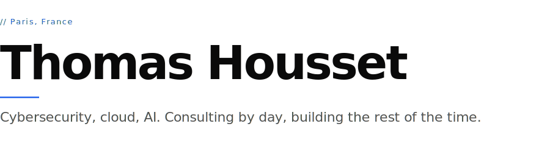

<picture>
  <source media="(prefers-color-scheme: dark)" srcset="./assets/hero-dark.svg">
  
</picture>

&nbsp;

Hybrid profile: GRC and strategic advisory, cloud and DevSecOps engineering, AI governance research, and a steady stream of side projects. The mix is the point.

### Currently

Cybersecurity consultant at **[Advens](https://www.advens.com)** in Paris, working on cloud security, AI governance, and M&A cyber due diligence. Writing a master's thesis on sovereign AI governance at **Oteria Cyber School**, defending July 2026.

Previously Deputy CISO at **Mercedes-Benz Athlon** (2021–2024).

### Building

| | |
|:--|:--|
| **[acquis.app](https://acquis.app)** | OSINT platform for M&A cyber due diligence |
| **[research.thomas.how](https://research.thomas.how)** | Public research hub: thesis, projects, certifications, notes |
| **[WayTrace](https://github.com/HXLLO/WayTrace)** | Wayback Machine intelligence toolkit, crash-resumable |
| **[RegulAIte](https://github.com/HXLLO/RegulAIte)** | Multi-agent RAG over EU cyber regulation |
| **[FishSentinel](https://github.com/HXLLO/FishSentinel)** | Phishing simulation framework |

### Working with

`Python` &nbsp;·&nbsp; `TypeScript` &nbsp;·&nbsp; `Go` &nbsp;·&nbsp; `Rust` &nbsp;·&nbsp; `FastAPI` &nbsp;·&nbsp; `React` &nbsp;·&nbsp; `PostgreSQL` &nbsp;·&nbsp; `Docker` &nbsp;·&nbsp; `Terraform` &nbsp;·&nbsp; `Azure` &nbsp;·&nbsp; `Claude API`

### Studied

- **Microsoft AZ-104** — Azure Administrator
- **Microsoft AZ-500** — Azure Security Engineer
- **Anthropic** — [Claude API Development](https://verify.skilljar.com/c/e4gk4iaodja7)
- **Anthropic** — [AI Fluency](https://verify.skilljar.com/c/7ev2gowdo8va)

### Reach out

[thomas.how](https://thomas.how) &nbsp;·&nbsp; [research.thomas.how](https://research.thomas.how) &nbsp;·&nbsp; [LinkedIn](https://linkedin.com/in/thomas-hhh) &nbsp;·&nbsp; [housset.thomas@pm.me](mailto:housset.thomas@pm.me)
